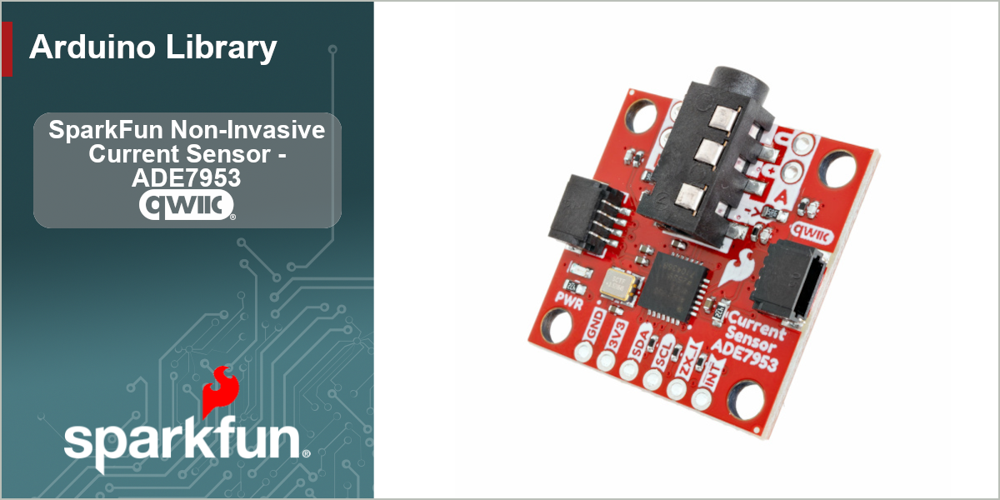

# SparkFun Qwiic Current Sensor - ADE7953

Arduino Library for the SparkFun Qwiic Current Sensor (ADE7953)


[](https://github.com/sparkfun/SparkFun_ADE7953_Arduino_Library/actions/workflows/test-compile-sketch.yml)


The [SparkFun Qwiic Current Sensor](https://www.sparkfun.com/sparkfun-qwiic-current-sensor.html) puts the Analog Devices ADE7953 single-phase energy metering IC on a Qwiic-enabled breakout, making clamp-on AC current measurement as simple as plugging in a cable. Paired with a current transformer (CT) clamp, the board measures RMS current without any electrical contact with the conductor being measured.

This library provides an easy-to-use interface to the ADE7953 over I2C, built on the [SparkFun Toolkit](https://github.com/sparkfun/SparkFun_Toolkit). It handles the device setup for you and returns real-world current readings in amps, while still exposing the lower-level registers for advanced use.

## Functionality

The library focuses on current measurement and the features most useful for it:

- RMS current measurement on Channel A (primary CT input) and the optional Channel B
- Real-world readings in amps, with built-in presets for common current clamps
- Programmable gain (PGA) and fine digital-gain control
- Software no-load calibration to remove the sensor's noise floor
- Peak / inrush current detection
- Zero-crossing detection and line-period (frequency) measurement
- A full interrupt system (overcurrent, zero-crossing, sag, cycle-end, and more)
- Sag detection and line-cycle accumulation configuration
- Diagnostics for the device's last-operation registers

> [!NOTE]
> This library targets current measurement via CT clamp. The ADE7953 is a full energy-metering IC (active/reactive/apparent power and energy), and the register map for those features is present in the driver, but the convenience API is centered on current. The lower-level register helpers can be used to access the additional features.

## Hardware Connections

The sensor connects over I2C using the Qwiic connector — no soldering required. The ADE7953 uses a single fixed 7-bit I2C address of `0x38`.

| Pin / Header | Use | Notes |
| -- | -- | -- |
| Qwiic / I2C | Power + communication | Standard 3.3V Qwiic connection |
| IAP / IAN | Current Channel A input | Connect your CT clamp here (primary channel) |
| IBP / IBN | Current Channel B input | Optional second CT clamp via the header pins |
| IRQ | Interrupt request (active low) | Optional — used for the interrupt examples |
| ZX | Zero-crossing output | Optional — pulses on each current zero crossing |

A burden resistor (5.6 Ω on the board) converts the CT's secondary current to a voltage the ADE7953 measures. The library's amps conversion accounts for this burden resistor and the CT turns ratio.

## Using the Library

### Installation

Install through the Arduino Library Manager by searching for **SparkFun ADE7953**, or download this repository as a ZIP and add it via *Sketch > Include Library > Add .ZIP Library*. This library depends on the [SparkFun Toolkit](https://github.com/sparkfun/SparkFun_Toolkit), which the Library Manager will offer to install alongside it.

### Getting Started

The I2C interface to the sensor is provided by the `SfeADE7953ArdI2C` class. Declare a sensor object:

```c++
#include <SparkFun_ADE7953.h>

// Declare our sensor object
SfeADE7953ArdI2C mySensor;
```

In `setup()`, start I2C and call `begin()`. `begin()` confirms the device is present, applies the datasheet-recommended performance configuration, and sets sensible defaults (4x PGA gain and the high-pass filter enabled) so a basic sketch works with no further setup:

```c++
Wire.begin();

while (mySensor.begin() == false)
{
    Serial.println("ADE7953 not connected, check your wiring!");
    delay(1000);
}
```

At this point the sensor is ready for normal operation.

### Reading Current

The simplest way to read current is `getCurrentA()`, which returns the RMS current on Channel A in amps:

```c++
float amps = 0.0;
mySensor.getCurrentA(amps);
Serial.print("Current (A): ");
Serial.println(amps, 4);
```

Channel B (the optional second input) is read with `getCurrentB()`. If you only need the raw register value, `getIRMSA()` / `getIRMSB()` return the unscaled RMS reading.

### A Note on Return Values and Error Handling

Most library methods return a SparkFun Toolkit error code (`ksfTkErrOk` on success, a negative value on failure) and pass the value back through a reference parameter. This lets you tell the difference between a real reading of zero and a communication failure. For simple sketches you can ignore the return value:

```c++
float amps;
mySensor.getCurrentA(amps); // assume good data
```

For robust applications, check it:

```c++
float amps;
if (mySensor.getCurrentA(amps) != ksfTkErrOk)
{
    // Handle the communication error
}
else
{
    // amps holds a valid reading
}
```

### Selecting a Current Clamp

To get accurate amps, the library needs the CT's turns ratio. Two common clamps are built in — pass one to `setCurrentClamp()` and it applies both the turns ratio and a suitable PGA gain for the board's 5.6 Ω burden resistor:

```c++
mySensor.setCurrentClamp(ADE7953_CLAMP_ECS1030); // SparkFun ECS1030-L72 (30A:15mA)
// or
mySensor.setCurrentClamp(ADE7953_CLAMP_SCT013);  // SCT-013-000 (100A:50mA)
```

Using a different clamp? Enter the turns ratio directly:

```c++
mySensor.setCurrentClamp(1800.0f); // custom turns ratio
```

### Calibration

Even with no current flowing, the ADC reports a small nonzero reading due to noise. `autoCalibrateA()` measures that no-load baseline by averaging a number of samples (taken with no current flowing) and removes it from future `getCurrentA()` readings:

```c++
// Run once at startup with NO load connected:
mySensor.autoCalibrateA(50); // average 50 no-load samples
```

The baseline is removed in the squared domain (`sqrt(reading² − baseline²)`), which is the correct way to subtract an RMS noise floor. Call `clearCalibration()` to reset it.

> [!NOTE]
> The ADE7953 also has a hardware IRMS offset register (AIRMSOS), accessible via `setIRMSOffsetA()` / `getIRMSOffsetA()`. That register operates in the squared domain with a scaling factor that depends on the datasheet, so the library's `autoCalibrate` uses a software baseline instead, which is exact and portable.

### Gain Configuration

The PGA gain is set per channel and is normally chosen for you by `setCurrentClamp()` or `begin()`. You can set it explicitly:

```c++
mySensor.setGainIA(ADE7953_PGA_GAIN_4); // 1x, 2x, 4x, 8x, 16x, or 22x (current channels only)
```

A digital (fine) gain can be applied on top of the PGA. Use a floating-point multiplier (1.0 = unity) and the library converts it to the nearest valid register value:

```c++
mySensor.setDigitalGainIA(1.1f); // +10%
```

### Peak / Inrush Detection

The ADE7953 continuously tracks the highest instantaneous current since the last reset — useful for catching motor startup surges and inrush:

```c++
uint32_t peak;
mySensor.getPeakIA(peak);            // running peak (does not clear)
mySensor.readAndResetPeakIA(peak);   // read and clear in one operation
```

### Interrupts

Channel A and Channel B each have interrupt enable and status registers, exposed as a bitfield so you can set or test individual events by name:

```c++
sfe_ade7953_irq_reg_t irqEnable = {};
irqEnable.oI = 1;                          // overcurrent
mySensor.setInterruptEnableA(irqEnable);

sfe_ade7953_irq_reg_t status = {};
mySensor.readAndResetInterruptStatusA(status);
if (status.oI)
    Serial.println("Overcurrent!");
```

### Zero-Crossing and Line Frequency

```c++
mySensor.setZXISourceChannel(false);     // Channel A drives the ZX output
mySensor.setZXEdge(ADE7953_ZX_EDGE_BOTH);

uint16_t period;
mySensor.getPeriod(period);              // line period from the ZX detector
```

## Examples

The library ships with a set of examples that build from the basics to more advanced features:

- [Example 01 - Basic Current Reading](examples/Example01_BasicCurrentReading/Example01_BasicCurrentReading.ino) — the minimal sketch to read current in amps
- [Example 02 - Dual Channel Current](examples/Example02_DualChannelCurrent/Example02_DualChannelCurrent.ino) — read both channels and select a clamp
- [Example 03 - Gain Configuration](examples/Example03_GainConfiguration/Example03_GainConfiguration.ino) — PGA and digital gain
- [Example 04 - Peak Detection](examples/Example04_PeakDetection/Example04_PeakDetection.ino) — track peak / inrush current
- [Example 05 - Zero Crossing](examples/Example05_ZeroCrossing/Example05_ZeroCrossing.ino) — zero-crossing detection and line frequency
- [Example 06 - Interrupt Pin](examples/Example06_InterruptPin/Example06_InterruptPin.ino) — overcurrent interrupt on the IRQ pin
- [Example 07 - Auto Calibration & Error Handling](examples/Example07_CalibrationOffset/Example07_CalibrationOffset.ino) — no-load calibration and error checking
- [Example 09 - Diagnostic Tool](examples/Example09_DiagnosticTool/Example09_DiagnosticTool.ino) — an interactive serial diagnostic sketch

## Documentation

API documentation is generated with Doxygen and published to GitHub Pages from the `main` branch.

## Products That Use This Library

- [SparkFun Qwiic Current Sensor - ADE7953](https://www.sparkfun.com/sparkfun-qwiic-current-sensor.html)

## Contributing

If you would like to contribute to this library, please report issues and submit pull requests against the GitHub repository.

## License

This product is open source! Please see [LICENSE.md](LICENSE.md) for more information.

- Your friends at SparkFun
